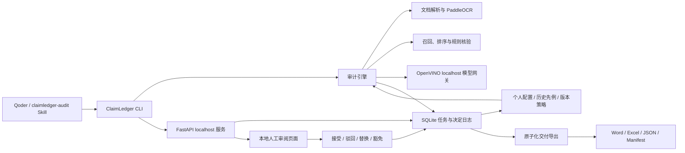

# ClaimLedger 技术架构

## 1. 设计目标

ClaimLedger 面向“报告已经写完、但还不能放心交付”的职业场景。系统必须同时满足：

1. 每条结论都能回到用户提供的原文件和精确位置；
2. 自动判断不越过证据边界，模型不能编造引文；
3. 高风险项必须经过人工决定，自动运行完成不等于批准；
4. 材料、模型、审阅和导出都留在本机；
5. 原始文件不被修改，审计轨迹可重放、可复验。

## 2. 系统边界



信任边界内只有本地进程、本地文件和 loopback 网络。系统不调用公开搜索，不把内容上传到云端，也没有本地模型失败后转云端的回退逻辑。

## 3. 核心模块

| 模块 | 职责 | 关键约束 |
|---|---|---|
| `cli.py` | 环境诊断、模型准备、服务、审计、决定、导出和基准测试 | 命令参数是稳定公共接口 |
| `ingestion.py` | 格式、加密、大小、路径和磁盘预检；建立只读快照与 SHA-256 | 原文件不覆盖，路径必须可解析 |
| `parsers.py` | DOCX、XLSX、PDF、PNG/JPG/TIFF 解析与 OCR 缓存 | PDF 有文本层时优先文本层；扫描页才 OCR |
| `engine.py` | 结论提取、候选证据召回、支持关系与确定性检查 | 结论是审计单元，复合结论可拆分 |
| `semantic.py` / `model_gateway.py` | `balanced` 模式下运行项目自带的 OpenVINO 本地网关 | 独立令牌、模型白名单、阶段加载、只允许 loopback |
| `storage.py` / `memory.py` | SQLite 任务恢复、决定、个人配置、历史先例与版本策略 | 决定追加写；先例仅建议；策略批准后只影响新任务 |
| `service.py` | localhost API、带令牌审阅页和源文件定位预览 | 只绑定 `127.0.0.1`/`localhost` |
| `exporters.py` | Word 批注、Excel 台账、JSON、清单和最终稿 | 交付包原子替换，输出重新计算哈希 |

## 4. 数据流

### 4.1 预检与快照

1. 校验待审报告必须是可读的 DOCX，证据目录必须在本地；
2. 拒绝损坏、加密、越界、超限或不支持的输入；
3. 为报告和每个证据文件计算 SHA-256；
4. 在任务目录创建输入快照、来源清单和 OCR 缓存；
5. 记录原始路径、快照路径、文件大小、解析状态和失败原因。

最终导出前再次核对原文件及快照完整性。任何哈希变化都会阻止交付。

### 4.2 解析与定位

| 格式 | 解析策略 | 定位 |
|---|---|---|
| DOCX | 保留段落、表格和 run 文本关系 | 段落或表格/行/列 |
| XLSX | 保留工作表、行标签、单元格值和上下文 | 工作表 + 单元格 |
| 文本 PDF | 优先读取文本层 | 页码 + 文本坐标框 |
| 扫描 PDF/图片 | PP-OCRv5 Mobile，按文件哈希缓存 | 页码/图片 + OCR 坐标框 |

低于规则包阈值的 OCR 结果进入 `needs_review`，不被静默当作确定事实。

### 4.3 结论、证据与检查

系统把报告正文中的数字、日期、金额、比例、单位、实体和关键叙述拆成 `Claim`。每条候选原文形成 `Evidence`，保存：

- 原文件 SHA-256；
- 精确原文与必要上下文；
- 页码、段落、单元格或 OCR 坐标；
- OCR 置信度、来源日期、排序分数和证据关系。

`lite` 使用本地词法与主题锚点召回，再执行确定性检查；`balanced` 可增加本地 Embedding、Reranker 和支持性判断。无论采用哪种 profile，模型都只能选择已经解析出的证据 ID，不能生成文件名、页码或引文。

`balanced` 若用模型补充关键结论，返回文本还必须是报告段落中的逐字连续子串；系统重新定位 `char_start`、`char_end`、`span` 和 `source_chunk_id`。模型改写、多余空格或无法回到原文的结论会被直接丢弃，不能进入审计台账。

确定性规则检查数值、数量级、日期、币种、单位、实体、品类、地区、时间窗口、税费、运费、分母、否定词、绝对化表述和跨来源冲突。行业差异通过 YAML 规则包表达：

- `generic-zh`
- `procurement-zh`
- `operations-zh`
- `consulting-zh`
- `lithium-demo`

核心引擎不绑定锂行业，也不执行招投标要求逐条比对。

## 5. 审计状态与交付门禁

自动状态固定为：

- `supported`
- `partial`
- `unsupported`
- `conflict`
- `stale`
- `needs_review`

状态描述证据关系，决定描述人如何处理风险，两者不能混用：

| 人工动作 | 含义 | 能否解除高风险阻断 |
|---|---|---|
| `accept` | 确认自动发现成立 | 否 |
| `reject` | 有理由地判定为误报 | 是 |
| `replace` | 用新文本替换定位到的结论 | 仅重新核查达到 `supported` 后 |
| `waive` | 由风险负责人书面承担业务风险 | 是，必须有理由和负责人 |

决定事件保留操作者、时间、理由、证据 ID、替换文本、风险负责人、豁免期限和复核结果。以下条件全部成立时才设置 `delivery_ready=true`：

1. 任务完成且存在审计发现；
2. 证据包解析覆盖为 `complete`；
3. 原文件和快照未变化；
4. 每个高风险项都有有效解决决定；
5. 最终导出重新生成整个交付包。

## 6. 交付设计

标准审计即生成：

- `annotated_report.docx`
- `claim_ledger.xlsx`
- `audit.json`
- `artifact_manifest.json`

人工门禁通过后增加：

- `delivery_report.docx`

Word 批注优先锚定精确 run；无法精确锚定时退化为段落定位并记录精度。Excel 包含概览、结论、规则检查、证据候选、决定日志、文件清单和审计配置。Manifest 保存输入和输出哈希、模型配置、规则包哈希、版本、运行参数、硬件平台及阶段耗时。

## 7. 审阅记忆与岗位模板

审阅记忆不是模型微调，也不是自动学习事实。它只保存个人批准过的最小化审阅先例：结论短摘、结论类型、规则包、规范化事实、issue code、决定动作、理由和来源任务，不跨任务复制完整证据引文。

`generic`、`audit`、`operations`、`consulting` 四类岗位模板只能提高关注级别或严重度，不能降低风险。每个任务创建时冻结配置、岗位模板、激活策略 ID、策略哈希和记忆 ID；任务运行后新增或停用策略不会改变历史结果。

`accept`、`reject`、`replace` 和 `waive` 的历史含义不同。尤其是 `waive` 永远不能提升为策略或证据。历史先例最多显示三条匹配结果及匹配因素，不能自动生成解决决定。人工策略必须经历“草稿 → 明确批准 → 新任务生效”，活跃版本只能停用，不能偷偷改写。

## 8. 本地模型生命周期

| Profile | OCR | 召回/判断 | 运行要求 |
|---|---|---|---|
| `deterministic` | 关闭 | 词法 + 确定性规则 | 基础 Python 依赖 |
| `lite` | PP-OCRv5 Mobile | 词法 + 确定性规则 | CPU；首次显式下载 OCR 模型 |
| `balanced` | PP-OCRv5 Mobile | OpenVINO 8B INT4 + 0.6B Embedding/Reranker | 项目自带 localhost 网关；CPU/GPU 由本机选择 |

`models install` 不带 `--execute` 时只返回计划，不下载权重。`status` 检查权重和 revision，`verify` 执行真实本地推理：

```bash
python scripts/claimledger.py models install --profile lite --execute --json
python scripts/claimledger.py models verify --profile lite --device CPU --json
```

Balanced 网关按阶段运行：8B 抽取结论后释放；批量计算全部结论和证据向量后释放 Embedding；最后加载 Reranker。网关绑定 `127.0.0.1`，使用独立令牌，并拒绝清单外模型。普通审计不得触发模型下载；任何 Balanced 失败都明确失败，不保留 Balanced 标签静默退回 Lite。

Apple M3 24 GB 上的 `lite` 端到端路径已经验证。`balanced` 的 Mac CPU 验证以实际技术报告为准；Intel AI PC CPU/GPU 数据尚未实测，不是功能依赖，也不预填推测结果。

## 9. 安全与故障策略

- API 使用服务启动时轮换的随机本地令牌，源文件预览前验证任务归属与哈希；
- 任务目录权限收紧为 `0700`，数据库、输入快照和交付文件为 `0600`；
- 服务 host 参数只接受 `127.0.0.1` 或 `localhost`；
- `CLAIMLEDGER_MODEL_GATEWAY_URL` 只接受 HTTP loopback 地址；旧的 `CLAIMLEDGER_OVMS_URL` 仅作 v0.3 兼容；
- 解析失败会把覆盖标记为 `incomplete` 并阻止最终稿；
- 引文哈希或来源清单被篡改时，标准交付物与最终稿都禁止导出；
- JSON、Manifest 和 Excel 对外产物不写入开发机绝对路径，运行时仍保留本地回跳所需的真实路径；
- 低置信度 OCR、定位不确定和缺失证据不会被强制提升为支持；
- 日志避免输出整段业务证据；
- 每次任务使用新目录，导出采用暂存目录后原子替换；
- Skill ZIP 不包含模型、缓存、数据库、任务、演示或用户材料。

## 10. 当前限制

- 待审报告仅支持 DOCX；首版不直接改写 PDF 或 PPTX；
- 不联网补证据，`unsupported` 仅表示当前封闭证据包中没有支持；
- 手写体 OCR 不在首版范围；
- `lite` 不提供向量语义召回，需 `balanced` 才启用本地语义模型；
- 个人配置是本机单用户能力；多人协作、远程部署和企业权限系统不在比赛版本范围；
- Intel AI PC 尚待实机验证。

这些限制是可信边界的一部分，不应在演示中隐藏。
