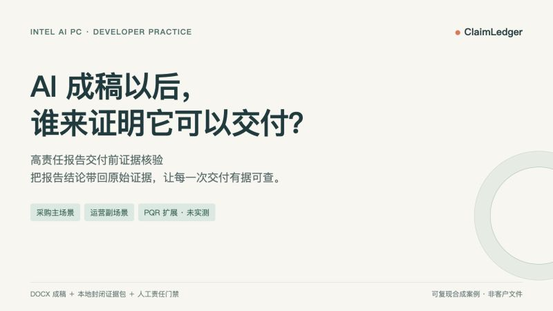
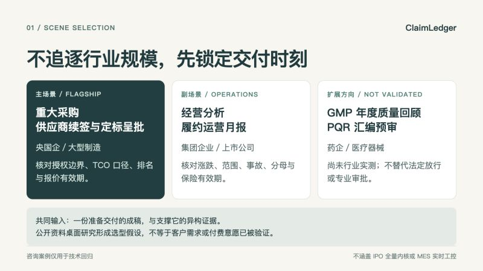
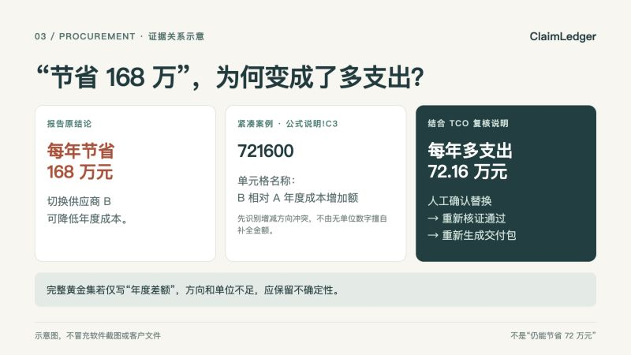
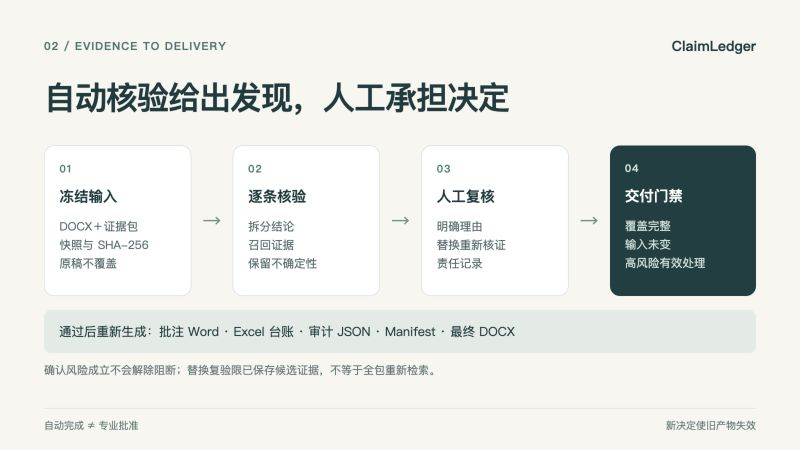
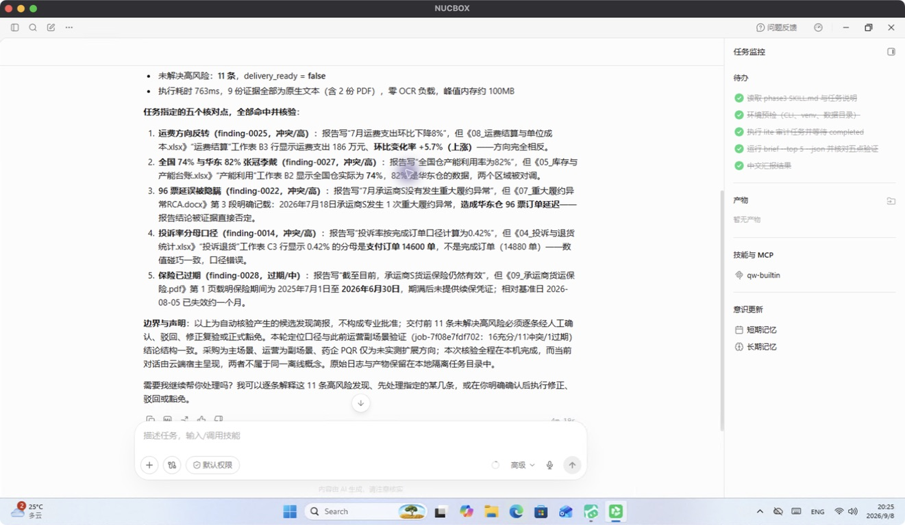
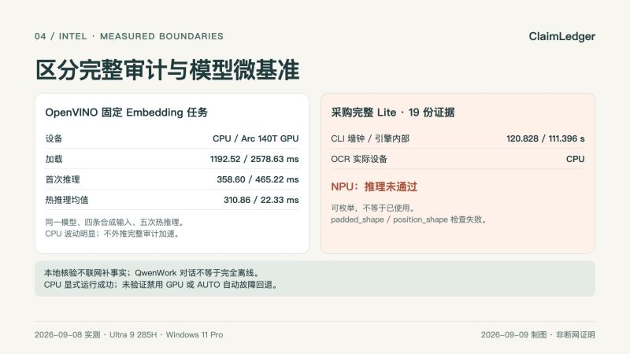

# ClaimLedger：AI 成稿以后，谁来证明它可以交付？

> ClaimLedger 是运行在 AI PC 上的“高责任报告交付前证据核验”Skill。它不替人写结论，也不联网补事实，而是把 DOCX 成稿逐条带回本地封闭证据包，完成定位、核验、人工决定与可信交付。

文稿核对日期：2026-09-09；下文黄金集与性能基准执行于 2026-09-08，重建包的安装验证与新对话截图为 2026-09-09。案例是可复现合成材料，不是真实客户文件。

## 一、高责任报告的跨行业共同断层

AI 已经能快速起草采购呈批、经营月报和质量回顾，但“文字写完”并不等于“可以交付”。真正影响决策的错误通常藏在跨文件关系里：正文和会议纪要的授权范围相反，Excel 的单位或分母被偷换，扫描报价已经失效，事故底稿存在但月报写成“无异常”。

这类任务的共同结构是：一份准备交付的成稿，加上一组 Word、Excel、PDF、图片和扫描件证据；审阅者必须在有限时间内证明关键结论有出处、口径一致、仍然有效，而且每个决定可以追溯。

ClaimLedger 补的不是通用写作能力，而是 AI 成稿后的证据责任层。

## 二、调研如何收敛出三层场景

本轮调研是公开资料的桌面研究，不是客户访谈或真实业务盲测。我们从制造工业、医药合规、央国企采购、零售运营等问题原型出发，按金额与责任强度、发生频率、文档异构度、精确定位价值、本地部署适配性和可复现性筛选场景，最终形成三层结构。该选型是产品假设，尚不能证明客户付费意愿或节省工时：

- 主场景：央国企／大型制造重大采购、供应商续签与定标呈批。金额高、授权和 TCO 口径刚性，Word、Excel、PDF 扫描件齐全。
- 副场景：集团企业／上市公司经营分析与履约运营月报。每月重复发生，涨跌、范围、事故、分母和有效期错误直观且高频。
- 扩展场景：药企／医疗器械 GMP 年度质量回顾 PQR 汇编预审，用于说明同一证据核验框架的迁移方向，目前不声称已经完成实测。

咨询黄金集继续保留为技术回归，不抢占产品叙事。法定药品放行、IPO 全量内核、MES 实时工控和自动法律合规结论明确排除。

## 三、千万级采购案例：错误不是措辞问题

主案例是一份年度 1,200 万个纸餐盒采购续签呈批，预算 1,080 万元。报告看起来完整，却包含四个会改变决策的结论：

1. 报告称采购委员会已批准 B 占 70%、A 占 30%；会议纪要实际只批准 B 先试供 30%，A 保留 70%。
2. 报告称切换 B 每年节省 168 万元；紧凑演示的 Excel `公式说明!C3` 为 721600，名称明确写作“B相对A年度成本增加额”。结合统一 TCO 口径的复核说明，正确结论是 B 比 A 每年多支出 72.16 万元。
3. 报告称 B 的综合到岸成本最低；TCO 复核表显示 B 排名第 3。
4. 报告称三家报价均有效至 9 月 30 日；B 的扫描报价单明确写着 8 月 31 日到期。

这里必须区分“案例事实”和“自动识别程度”。紧凑演示根据 C3 的明确命名识别成本增减方向冲突，不由一个缺少单位的数字直接推断完整金额；完整采购黄金集 C3 只写“年度差额”，系统保留部分支持的不确定性。报价有效期在紧凑初始任务中也为部分支持，相关 B 日期候选位于第 6 位，不应宣称已经自动精准命中前五。图中呈现的是证据关系示意，不是原始软件截图。

演示材料不是客户文件。它们是公开问题原型驱动、脱敏重构并主动植入风险的可复现合成案例，用来验证系统是否真能回到原文件和精确位置。

## 四、从 Evidence ID 到交付门禁

ClaimLedger 先做输入预检、快照和 SHA-256，再拆分可核查结论。解析片段与候选证据保留任务内引用标识，位置保留为 PDF 页码与坐标、Word 段落或表格、Excel 工作表与单元格。Evidence ID 用于本任务的证据引用，不是跨任务永不变化的内容地址；文件完整性由哈希与快照核验。可选模型只能引用已有证据，不应编造文件名、页码或引文。

系统检查数字、日期、币种、单位、主体、地区、统计范围、分母和有效期，并把关系标为已支持、部分支持、无法支持、冲突、过期或需要复核。

自动状态不是业务决定。人工动作有严格含义：`accept` 只确认风险成立，不解除高风险阻断；`reject` 必须说明误报理由；`replace` 必须对新文本重新核证；`waive` 必须记录理由、责任人及可选到期时间。新增决定会使旧产物失效，最终稿只能在任务完成、证据覆盖完整、输入未变化且高风险得到有效处理后生成。原始报告永不覆盖。

本轮紧凑采购任务 `job-3265ae7c789e` 初始有 2 项高风险，实际调用最终导出被门禁拒绝。用户确认份额、成本结论、报价有效期三条替换后，系统逐条复验通过，重新生成批注 Word、Excel 台账、审计 JSON、Manifest 和最终 DOCX，五个文件逐一校验哈希。原报告未覆盖。两条中风险提示仍保留，门禁通过不等于所有提示消失，也不等于真实采购审批完成。当前替换复验只使用该发现已保存的候选证据，不会重新检索整个证据包。

## 五、运营月报的五类高频偏差

副案例把同一底层能力放到高频经营汇报中：

- 报告写“运费环比下降 8%”，底表实际上涨 5.7%；
- 把华东仓 82% 冒充全国 82%，全国综合实际为 74%；
- 报告写承运商 S 无重大异常，RCA 记录 96 票订单延迟；
- 投诉率声称按完成订单计算，分母却使用支付订单；
- 报告称货运保险有效，保单已到期且没有续保证据。

这些并非五个行业专用规则，而是方向、范围、遗漏、口径和时效五类可迁移的证据关系。

## 六、QwenWork 调用与 Intel Lite OCR 实测

配图为 2026-09-09 全新对话任务 `job-a534a2564bba` 的实际屏幕截图，使用重建后的 Skill；没有复用旧截图或录屏。该任务 completed、证据覆盖完整、0 条人工决定；28 条结论中有 11 条冲突、1 条过期，仍有 11 项高风险，交付门禁保持锁定。设备桌面时区与文章日期不同，未修改设备时钟。

本轮在主办方提供的 Intel Core Ultra 9 285H、约 63.53 GiB 可见内存、Windows 11 Pro 设备上重跑。实测宿主是 QwenWorkCN 1.0.4.26090412（千问办公），不是 WorkBuddy；通过自然语言读取并调用 `claimledger-audit`。原始文件解析、PaddleOCR、SQLite 审计状态和产物生成在 Intel 设备本地完成。

采购完整 Lite 新任务 `job-a869fad5b3d8` 覆盖 19 份异构证据：独立 CLI 墙钟 120.828 秒，引擎内部总耗时 111.396 秒，峰值 RSS 2,156,126,208 bytes，PaddleOCR 实际设备为 CPU。该任务有 12 项未解决高风险，不能生成最终稿。上述数值不与含补充说明的 20 份证据紧凑任务混算。

运营副场景 Lite 新任务 `job-8e3882a87862` 产生 28 条结论、11 条冲突和 1 条过期，五类关键偏差均有对应来源与定位。QwenWork 新对话产生独立任务 `job-7f08e7fdf702`，输入哈希与 CLI 一致，返回中文简报；没有代替用户提交人工决定。运营材料无需 OCR，不能把它的短耗时宣传成 OCR 提速。

本轮没有执行物理断网验证。核心核验不联网补事实，但模型需预先安装；QwenWork 可能使用云端模型，整段 Agent 对话不等于完全离线。对于真实私有文件，原文、简报或工具输出进入云端也属于披露，必须另获授权；本次公开合成案例的演示不构成私有数据上传授权。

## 七、OpenVINO CPU／GPU 对照与 NPU 边界

2026-09-08 固定同一个 Qwen3-Embedding-0.6B FP16 OpenVINO 模型和四条合成输入，每个设备独立进程运行一次首次推理及五次热推理。CPU 加载 1192.52 毫秒，首次推理 358.60 毫秒，热推理均值 310.86 毫秒；Intel Arc 140T GPU 加载 2578.63 毫秒，首次推理 465.22 毫秒，热推理均值 22.33 毫秒。两者均返回 4×1024 向量，CPU 热推理存在明显波动，不把单次小样本当成稳定性能承诺。

显式选择 CPU 的独立进程成功；本轮没有物理禁用 GPU，也没有验证 AUTO 自动故障回退。这与“GPU 故障时自动回退已经验证”不是同一结论。

这些数字只代表该 Embedding 小任务，不能外推成完整审计的加速倍数。Intel AI Boost NPU 可以被 OpenVINO 枚举，但该模型因 shape check 失败，没有完成验证；本文不声称 ClaimLedger 已使用 NPU。

## 八、黄金集指标、采购短板与未完成验证

2026-09-08 修复后的代码在三套合成黄金集上重跑 100 条结论和 49 条植入风险：48 TP、0 FP、1 FN；风险 Precision 100%，Recall 97.96%，F1 98.97%；状态准确率 97%；严格证据 Top-5 Recall 93%；高风险 Recall 87.80%；Issue-code Micro F1 78.30%。

高风险 Recall 与错误类型 F1 相比修复前下降。修复消除了“年度差额误配单项模具费”的错误，并对方向、单位不足的底表保留不确定性；我们不为维持漂亮数字修改证据、标签或风险门槛。

采购是明显短板：严格证据 Top-5 Recall 为 84.09%，低于运营和咨询的 100%。它包含扫描件、多张回单、Excel 多口径和更多相近候选，因此也更接近我们要解决的困难现场。

这些都是合成案例指标，不是真实客户效果。真实客户盲测、独立第二审阅者、药企 PQR 实测、完整 Balanced 和 NPU 兼容性仍未完成，继续作为公开待验证项。

## 九、Hybrid AI 是责任分层，不是隐蔽兜底

在 ClaimLedger 中，CPU 负责预检、哈希、结构解析和确定性规则；PaddleOCR 负责扫描材料识别；本地检索和可选 OpenVINO 模型负责召回与排序；人工负责误报判断、替换和风险豁免；交付门禁确保高风险不会被悄悄跳过。

云端能力只有在用户明确授权后才适合处理公开知识或通用写作，不能在本地模型失败时隐蔽接管内部证据，更不能绕过人工决定。所谓 Hybrid AI，是结构化工具、专项本地模型、可选算力增强和人工责任的组合。

## 十、项目与披露

- Skill：`claimledger-audit`
- 展示名：ClaimLedger：高责任报告交付前证据核验
- ModelScope Skill：[Eason663/claimledger-audit](https://modelscope.cn/skills/Eason663/claimledger-audit)
- 项目源码：[ClaimLedger](https://github.com/eason4kim-rocket/ClaimLedger)
- 许可证：Apache-2.0
- Skill 标签：`AI PC`
- 文章标签：`Intel AI PC`

本文未附尚未完成的视频链接。候选包版本 v0.5.1、构建标识 `20260909-stage3`，ZIP SHA-256 为 `f85d0e8202c6eb004d4ef91d9585ac7d7f66f46cc7b31aaf9383f1a629a7d9f7`。Mac 全新 Python 3.11 环境 120 项测试通过；Windows 全新 Python 3.12 环境 119 项通过、1 项 POSIX 专属测试跳过。两端均通过 pip check、doctor 和 Wheel 安装后的最小审计；干净基础环境未安装可选 OCR/模型权重，Intel Lite 另用已配置的本地运行环境验证。

源码远端与已发布 Skill 可能落后于本地修复；发布前须用待发布包的 SHA-256 和安装验证结果确认实际版本，不能仅凭版本号认定内容一致。

**案例披露：**文中采购、运营与咨询材料均为公开问题原型驱动、脱敏重构并主动植入风险的可复现合成案例，不是真实客户文件，不构成客户背书、生产部署证明或真实业务批准。
